# Example - fitting droplet timecourse model

## Section 1) Introduction

In this notebook we are trying to perform parameter fitting on the full timecourse model.

The model equations are

$
\begin{gather}
\begin{aligned}
    \frac{\mathrm{d} \phi_1}{\mathrm{d}t} &= b - f \phi_1 \sum_{i=1}^{N-1} \phi_i - g \phi_1 \, ,\\
    \frac{\mathrm{d} \phi_n}{\mathrm{d}t} &= \frac{1}{2} f \sum_{i=1}^{n-1} \phi_i \phi_{n-i}
    - f \phi_n \sum_{i=1}^{N-n} \phi_i
    + g \phi_{n-1} - g \phi_n \, ,
    \quad n = 2,\dots,N-1 \, ,\\
    \frac{\mathrm{d} \phi_N}{\mathrm{d}t} &= \frac{1}{2} f \sum_{i=1}^{N-1} \phi_i \phi_{N-i}
    + g \phi_{N-1} \, ,
\end{aligned}
\end{gather}
$
where 
- $t \in [4, 14]$ is the time
- $\phi_n(t)$ is the count of droplets of size $n$, at time $t$
- $N=51$ is the maximum droplet size bin.
- $\theta = \{b, f, g\}$ are the model parameters

The equations are closed with initial conditions $\phi_n(t_0=4) = \phi_n^0$ .

---

### Section 1.1) - Example experimental data

For the experimental data, we choose to use _NTC_ data from the full dataset, pool $1$.

    
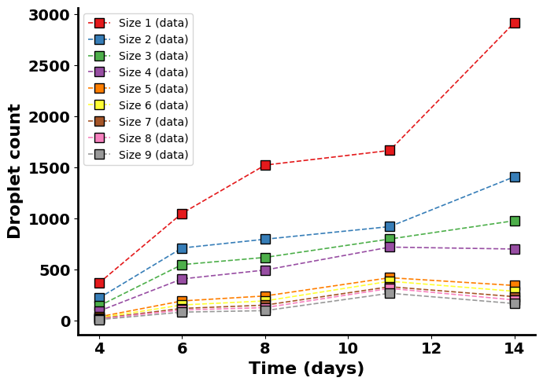
    

---

## Section 2) Additive Normal noise model

For this section we assume additive normal noise, so

$
\begin{equation}
    \phi_n^\text{data}(t_j) = \phi_n^\text{model}(t_j \, ; \, \bm{\theta}) + \varepsilon \quad ; \quad \varepsilon \sim \mathcal{N}(0, \sigma_n^2) \, .
\end{equation}
$
### Section 2.1) Finding the MLEs

In order to get an initial guess for the parameters, we will try and find the MLEs, $\hat{\theta}$.

To do this, we will use an optimisation routine to find the combination of parameters that maximise the log-likelihood.

##### Plot the MLE solution

    
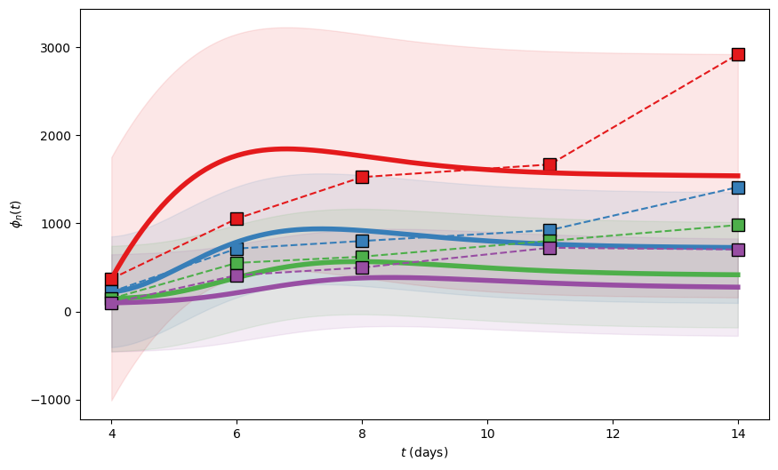
    

---

### Section 2.2) - Using the MLEs to perform Bayesian inference

    
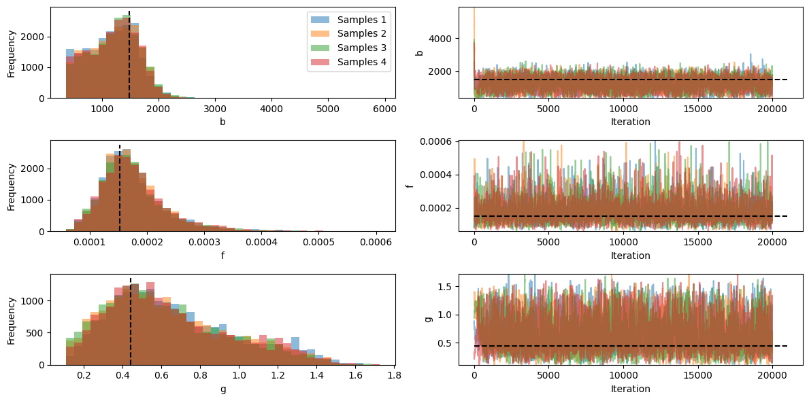
    

##### Plot chains pairwise distributions

    
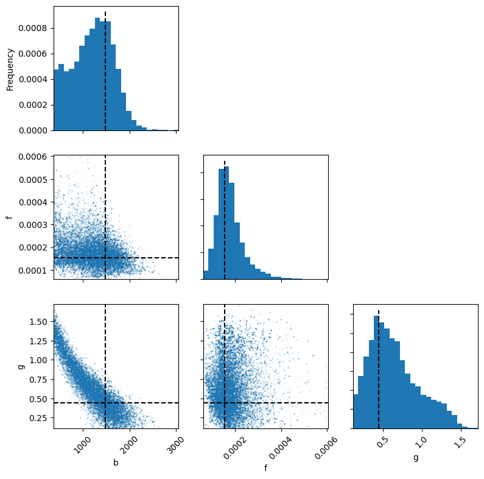
    

We observe that $b$ and $g$ cannot not be individually identified from this data alone.

##### Posterior predictive check

    MAPS: [1.20591543e+03 1.76678531e-04 6.43133877e-01]
    

    
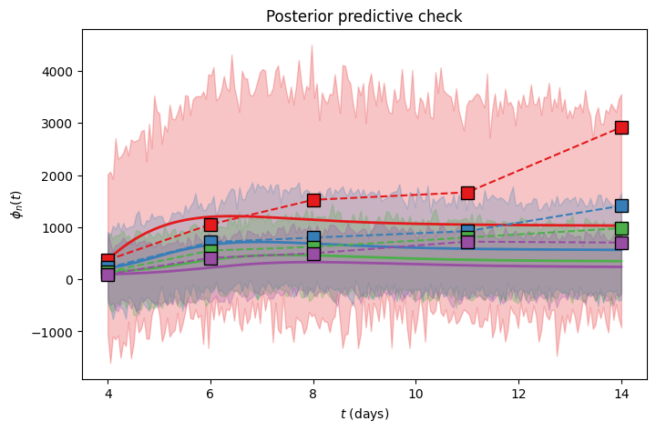
    

---

### Section 2.3) - MCMC with $b$ fixed

##### Diagnostic plots

    
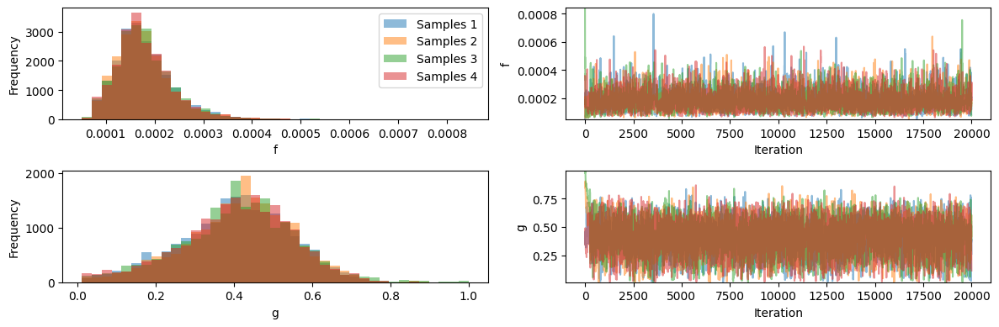
    

    
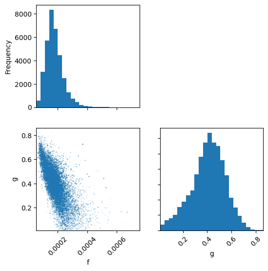
    

##### Plot series using MAPS

    
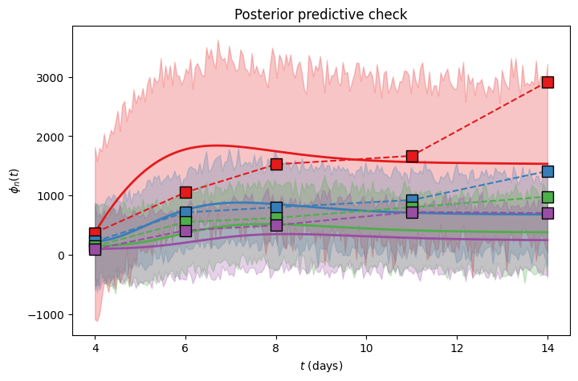
    

---

### Section 2.4) - MCMC with $g$ fixed

##### Diagnostic plots

    
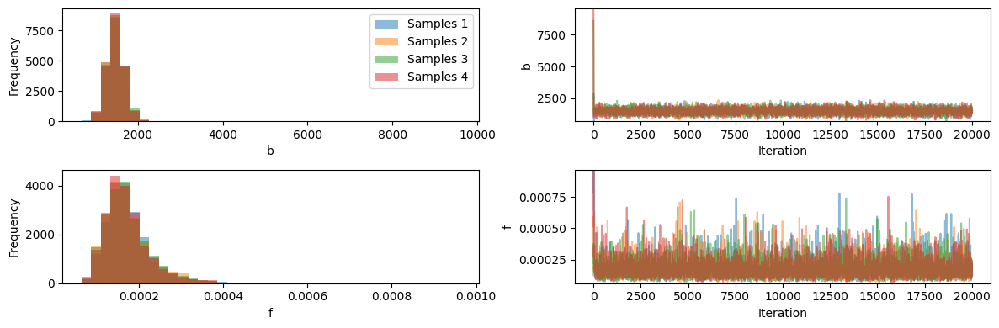
    

    
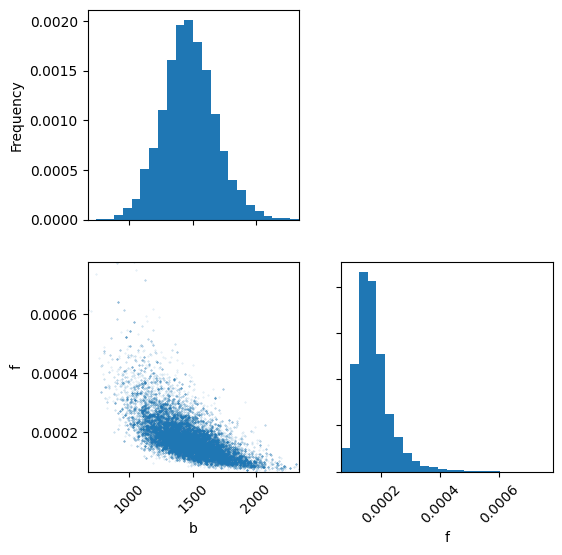
    

##### Plot series using MAPS

    MAPS: [1.47089814e+03 1.73720296e-04 4.42657138e-01]
    

    
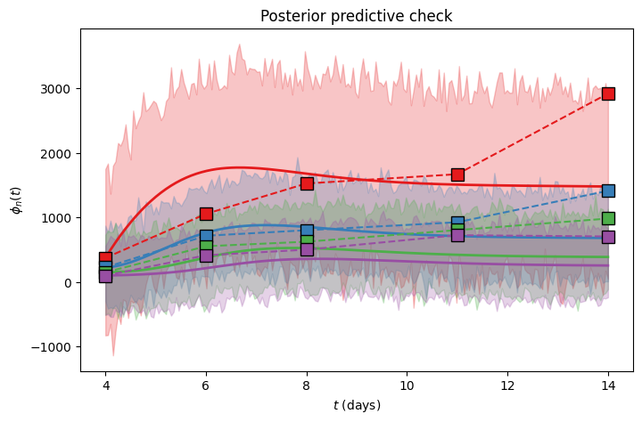
    

---

### Section 2.5) -  Re-parameterise, and infer $b = u + g \, v$

##### Re-parameterised model MCMC

##### Diagnostic plots

    
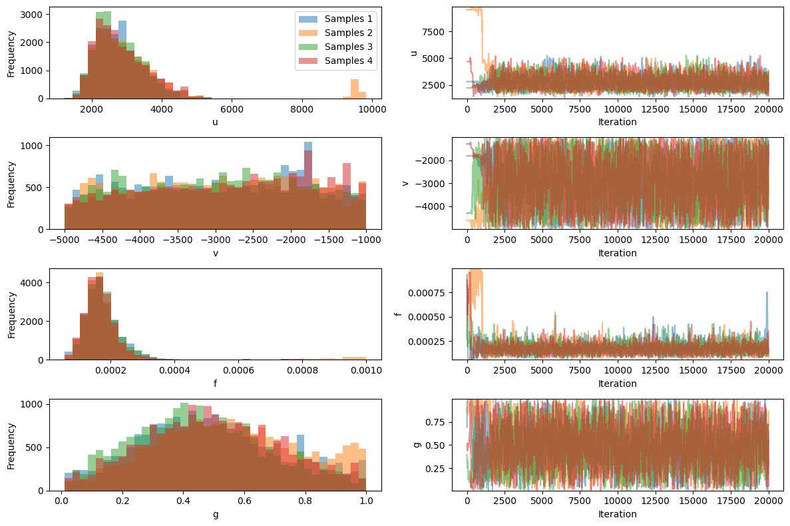
    

    
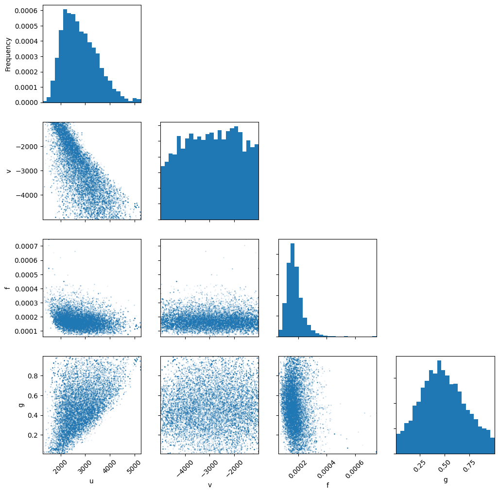
    

##### Plot series using MAPS

    MAPS: [1.42860880e+03 3.64845284e-04 5.58075485e-01]
    

    
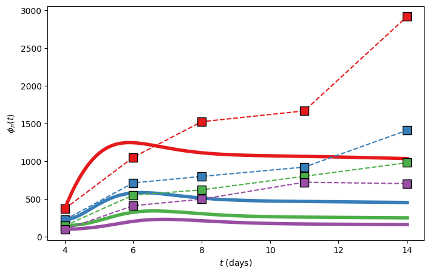
    

---

## Section 3) - Multiplicative normal noise

For this section we assume multiplicative normal noise, so

\begin{equation*}
    \phi_n^\text{data}(t_j) = \phi_n^\text{model}(t_j \, ; \, \bm{\theta}) (1 + \varepsilon) \quad ; \quad \varepsilon \sim \mathcal{N}(0, \sigma_n^2) \, .
\end{equation*}

##### Diagnostic plots

    
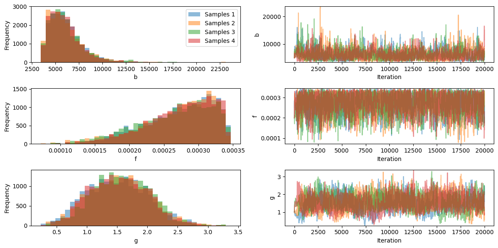
    

    
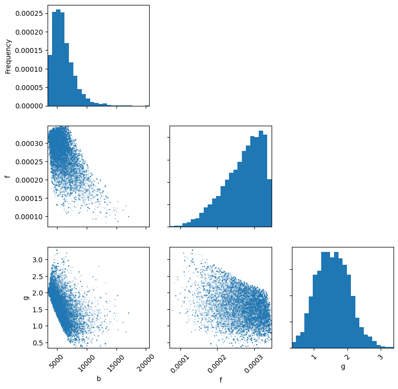
    

    MAPS: [6.05311532e+03 2.69116554e-04 1.56448021e+00]
    

    
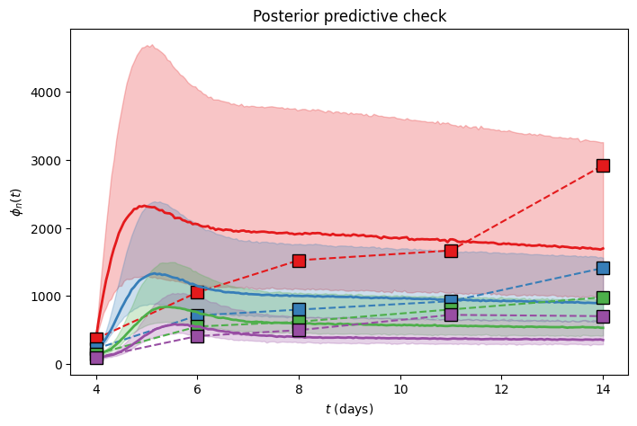
    

---

## Section 4) - Lognormal noise model

For this section we assume log-normal noise, so

$
\begin{equation}
    \phi_n^\text{data}(t_j) = \phi_n^\text{model}(t_j \, ; \, \bm{\theta}) \exp(\varepsilon) \quad ; \quad \varepsilon \sim \mathcal{N}(0, \sigma_n^2) \, .
\end{equation}
$

##### Diagnostic plots

    
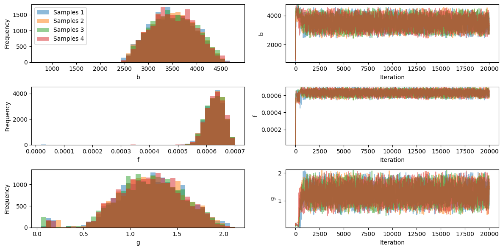
    

    
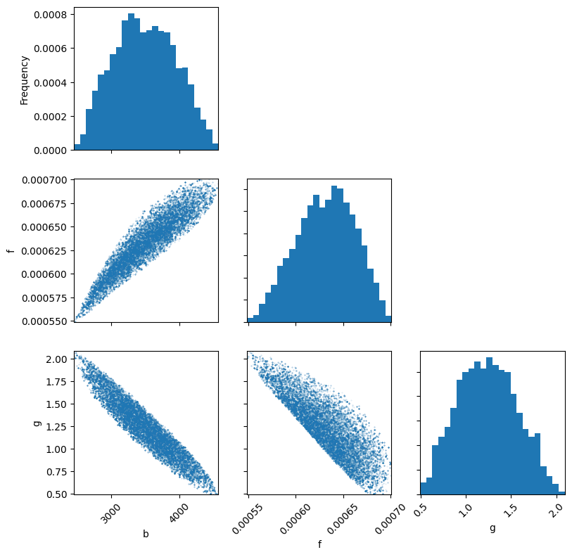
    

    MAPS: [3.49215355e+03 6.31540727e-04 1.24056412e+00]
    

    
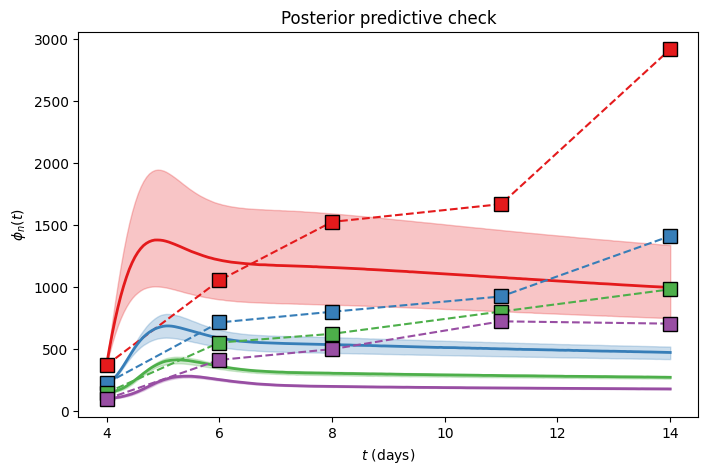
    

---

## Section 5) - Autoregression noise

##### Diagnostic plots

    
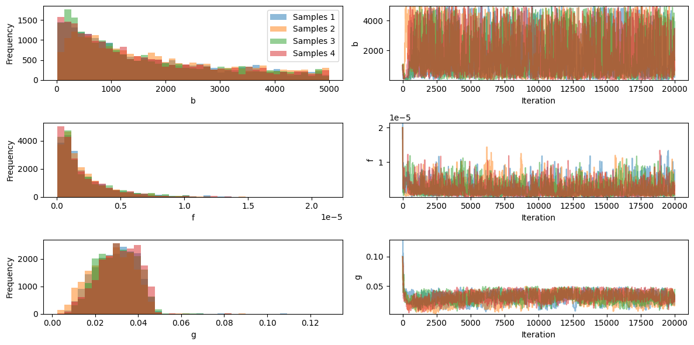
    

    
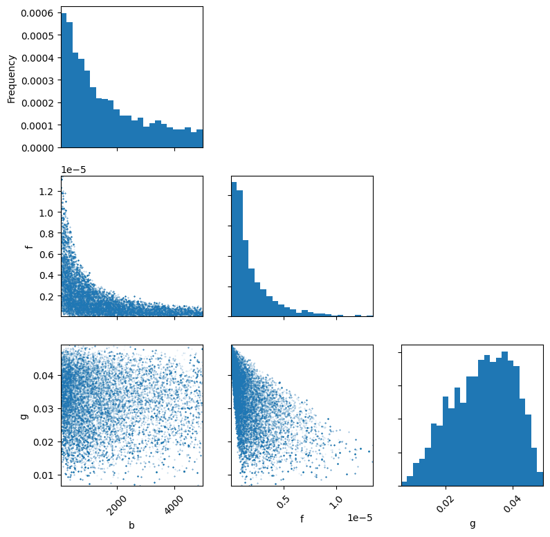
    

